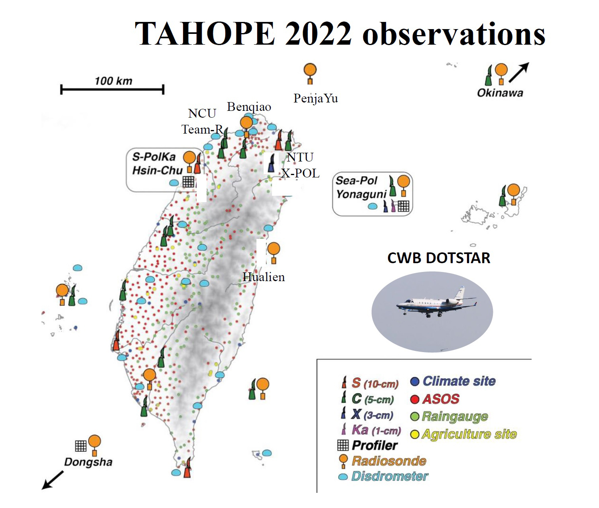

Briefder introduction of TAHOPE observations
===========================================

The spatial distribution of observation instruments are around Taiwan (Fig 1.).

The part of observation raw and processing data are supplid from Central Weather Bureau(CWB).

Fig 1. Observations location for TAHOPE 2022 (`Reference <http://140.137.32.27/exp/yesr2022/report/TAHOPE_Basemap.html>`_)

+------------------------+------------+----------+----------+
| Observation Instrument | Variables  | Frequency| Note     |
|                        |            |          |          |
+========================+============+==========+==========+
| Satellite              | Infrared, Visible  | Taiwan area: 10  | column 4 |
|                        |                    | East Asia: 30    |          |
+------------------------+------------+----------+----------+q
| Radar(Raw)             | dBuZ, dBZ, KDP, PhiDP, RhoHV, SNR, SQI, uPhiDP, V, W, ZDR  |   <  10    |          |
+------------------------+------------+---------------------+
| Radar(Processed)       | Mosaic 2D, Mosaic 3D, QPE 1 hour |   |     |
+------------------------+------------+----------+----------+
| Disdrometer            |  Particle Size, Particle speed, Rainrate intensity  |        |   |
+------------------------+------------+---------------------+
| Sounding               |            |          |          |
+------------------------+------------+---------------------+
| Surface                |            |                     |
+------------------------+------------+---------------------+
| Wind profiler          |            |                     |
+------------------------+------------+---------------------+
| Lightning              | Inner Cloud, Cloud to Ground, Flash Time  |                     |  |
+------------------------+------------+---------------------+

