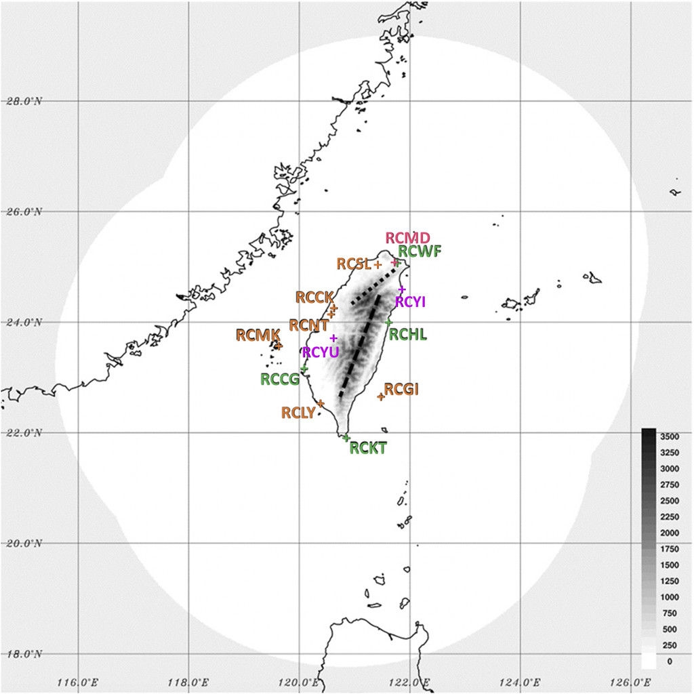

================================
Brief introduction of radar data
=================================

The weather radar network in Taiwan (`Reference <https://journals.ametsoc.org/view/journals/bams/102/3/BAMS-D-20-0043.1.xml>`_)

During TAHOPE, CWB supply raw radar data and processed radar data.

^^^^^^^^^^^^^^^^^^^^^^^^^^^^^^^^^^^^^^^^^^^^^^^^^^^^^^^^^^^
.. list-table:: The radar name, variables and data format
   :widths: auto
   :header-rows: 1

   * - Radar name
     - Variables
     - File name
     - Data format
     - Frequecy (Minute)
   * - RCWF
     - -
     - yyyymmdd_HHMM_RCWF_VOL.^\d{3}.gz
     - NEXRED
     - < 10 
   * - RCGI
     - dBuZ, dBZ, KDP, PhiDP, RhoHV, uPhiDP, V, W, ZDR
     - yyyymmddHHMMSS00$Variables.vol
     - Rainbow 5
     - < 10
   * - RCLY
     - dBuZ, dBZ, dBZv, KDP, PhiDP, RhoHV, SNR, uPhiDP, V, W, ZDR
     - yyyymmddHHMMSS00$Variables.vol
     - Rainbow 5
     - < 10
   * - RCCK, RCMK
     - dBuZ, dBZ, KDP, PhiDP, RhoHV, uKDP, uPhiDP, V, W, ZDR
     - yyyymmddHHMMSS00$Variables.vol
     - Rainbow 5
     - < 10
   * - RCMD, RCNT, RCSL
     - dBuZ, dBZ, KDP, PhiDP, RhoHV, SNR, SQI, uPhiDP, V, W, ZDR
     - yyyymmddHHMMSS00$Variables.vol
     - Rainbow 5
     - < 10
   * - RCCG, RCHL, RCKT
     - dBZ, V, W
     - yyyymmddHHMMSS00$Variables.vol
     - Rainbow 5
     - < 10

^^^^^^^^^^^^^^^^^^^^^^^^^^^^^^^^^^^^^^^
.. list-table:: Radar Processing data
   :widths: 33 33 33
   :header-rows: 1
   
   * - Categorey
     - File name
     - Data format
   * - MOSAIC2D
     - COMPREF.yyyymmdd.HHMM.gz
     - self define
   * - MOSAIC3D
     - MREF3D21L.yyyymmdd.HHMM.gz
     - self define
   * - QPE1HR
     - CB_GC_PCP_1H_RAD.yyyymmdd.HHMM.gz
     - self define

